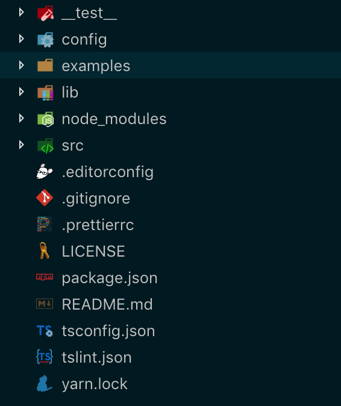

# ts-lib


[](https://coveralls.io/github/ZekeXu/ts-lib?branch=master)
[](https://travis-ci.org/ZekeXu/ts-lib)
[](https://circleci.com/gh/ZekeXu/ts-lib/tree/master)

TypeScript library initial code.

## 一、功能

- TypeScript
- Prettier + TSLint
- Git Hooks
- Unit Test(Jest)
- commitlint
- editorconfig
- stylelint
- changelog
- commit提示 使用```yarn commit``` 代替 ```git commit```
- Travis CI

## 二、需要修改的文件

- package.json

## 三、参考

### 1.推荐目录结构



### 2.参考链接

[changelog format](https://github.com/conventional-changelog/conventional-changelog-config-spec/blob/master/versions/2.0.0/README.md)

### 3.Commit推荐格式

```bash
<type>(<scope>): <subject>
<BLANK LINE>
<body>
<BLANK LINE>
<footer>
```

### 4.私有项目可去掉 Travis CI 和 Coveralls

```bash
yarn remove coveralls
```

packages.json删除下面这行

```json
{
  "scripts": {
    "coverage": "jest --coverage --coverageReporters=text-lcov | coveralls"
  }
}
```

删除文件 ___.travis.yml___

### 5. 使用 ```yarn audit```检测有漏洞的deps

## LICENSE


Copyright (c) 2019 ZekeXu
